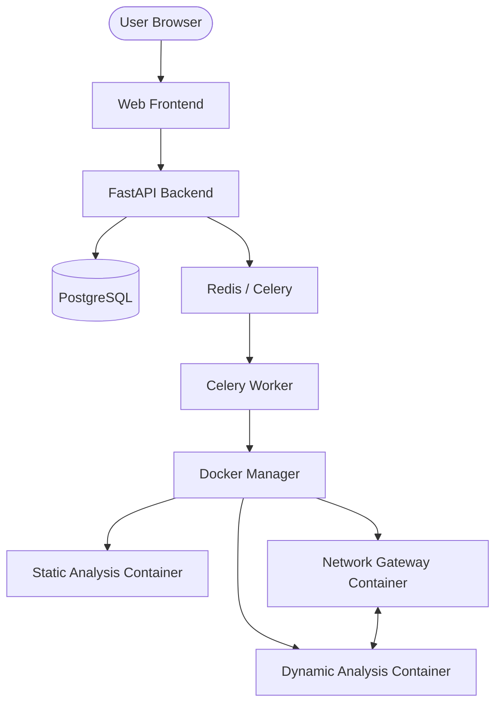

# Project Pegasus 🛡️

**Secure Malware Analysis Platform**

Project Pegasus is a comprehensive malware analysis platform that performs automated static and dynamic analysis in isolated Docker environments. It provides a secure, web-based interface for analysts to examine suspicious files, extract indicators of compromise (IOCs), and observe malicious behavior while ensuring complete host isolation.

## Features

- **🔒 Secure Isolation**: All analysis runs in unprivileged, network-isolated Docker containers with resource limits and capability dropping.
- **� Robust Static Analysis**:
    - PE Header & Import parsing
    - **Intelligent String Ranking**: Prioritizes interesting APIs, paths, IPs, and URLs.
    - **CAPA Integration**: Resilient capability detection for PE variants.
    - YARA scanning and Entropy calculation.
- **🔍 Advanced Dynamic Analysis**:
    - **Unified Execution Monitoring**: Combines `strace` syscall logging with `psutil` process tracking.
    - Wine & QEMU support for cross-architecture PE analysis.
    - Behavioral logs for file operations and process creation.
- **🌐 Network Traffic Capture**:
    - **INetSim Integration**: Provides a simulated internet environment (DNS, HTTP, etc.).
    - **IPv6 Support**: Full capture and parsing of IPv6 traffic and DNS (AAAA).
- **🔎 Report Management**:
    - **Hash Search**: Look up existing reports by SHA256.
    - **One-Click Re-analysis**: Instantly trigger fresh analysis runs for any sample.
- **💾 Unified Reporting**: Clean, real-time Web UI for monitoring progress and viewing results.

## Architecture



## Prerequisites

- **Docker** (20.10+) & **Docker Compose** (V2)
- **Python 3.11+** (for test scripts and local development)
- **Make** (optional, for automation)

## Quick Start

### 1. Initial Setup
```bash
./setup.sh
```
This script will verify dependencies, generate secure `.env` keys, and build the required Docker images.

### 2. Start the Platform
```bash
docker compose up -d
```
Access the Web UI at: `http://localhost:3000` (or open the local file directly).

### 3. Verify System
```bash
python3 test_system.py
```

## API usage

- **Docs**: `http://localhost:8000/api/docs`
- **Upload**: `POST /api/upload/`
- **Results**: `GET /api/analysis/{sample_id}`
- **Search**: `GET /api/analysis/?sha256={hash}`

## Development Roadmap

### Phase 1: Core Infrastructure ✅
- [x] Project structure & Database models
- [x] Celery & Redis orchestration
- [x] Secure file quarantine (AES-128 encryption)

### Phase 2: Static Analysis ✅
- [x] REMnux-based analyzer
- [x] Intelligent String Ranking
- [x] Robust CAPA integration

### Phase 3: Dynamic Analysis ✅
- [x] Unified behavior monitoring (strace + psutil)
- [x] Wine/QEMU binary emulation
- [x] Process & File tracking

### Phase 4: Network Analysis ✅
- [x] INetSim Gateway integration
- [x] IPv6 & AAAA DNS support
- [x] PCAP capture and automated parsing

### Phase 5: UI & UX ✅
- [x] Real-time analysis polling
- [x] Hash Search & Re-analysis
- [x] Prioritized multi-tab results view

### Phase 6: Hardening & Advanced Features (Current)
- [ ] User Authentication & Multi-Tenancy
- [ ] Advanced Memory Forensics integration
- [ ] Automated Report Export (PDF/JSON)

## Security Warning ⚠️

- **This system analyzes LIVE MALWARE**.
- Always run on dedicated hardware or within a detached VM.
- Verify network isolation (`test_system.py`) before analyzing unknown samples.
- Never expose the API to the public internet without proper authentication.

## License
Educational and authorized security research purposes only.

## Acknowledgments
- **REMnux** for the analysis toolset.
- **INetSim** for the simulated network services.
- **FastAPI** & **Celery** for the backend orchestration.
