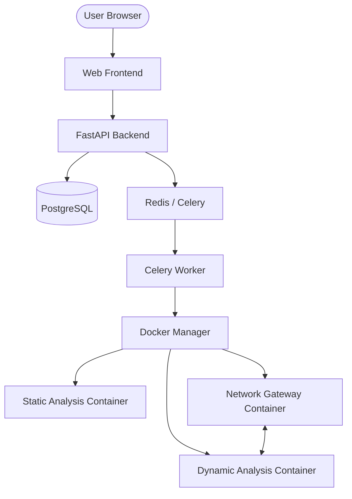

# Project Pegasus - Complete Setup Guide

This guide will walk you through setting up the complete Project Pegasus malware analysis platform.

## Prerequisites

### Required Software
- **Docker** (20.10+): [Install Docker](https://docs.docker.com/get-docker/)
- **Docker Compose** (V2): [Install Compose](https://docs.docker.com/compose/install/)
- **Python** (3.11+): For running test scripts
- **Git**: For cloning and version control

### System Requirements
- **CPU**: 4+ cores recommended
- **RAM**: 8GB+ (16GB recommended for multiple analyses)
- **Disk**: 20GB+ free space
- **OS**: Linux (Preferred), macOS, or Windows with WSL2

## Quick Start (5 minutes)

### 1. Initial Setup

```bash
# Run automated setup script
./setup.sh
```

This script will:
- Check for Docker and Docker Compose
- Create `.env` file with random secure keys
- Build all Docker images (Static, Dynamic, and Gateway)

### 2. Manual Setup (Alternative)

If you prefer manual setup:

```bash
# Copy environment template
cp .env.example .env

# Generate secure keys
# Note: ENCRYPTION_KEY must be a 32-character base64 string
openssl rand -hex 32  # Use for SECRET_KEY
openssl rand -base64 32  # Use for ENCRYPTION_KEY

# Edit .env and update the keys
# Update DATABASE_URL, REDIS_URL if using external services

# Build Docker images
./build-images.sh

# Start services
docker compose up -d
```

### 3. Verify Installation

```bash
# Check services are running
docker compose ps

# Test the system end-to-end
python3 test_system.py
```

## Architecture Overview



## Component Details

### 1. Backend (FastAPI + PostgreSQL + Redis)
- **Port 8000**: REST API & Documentation
- **Port 5432**: PostgreSQL (Data persistence)
- **Port 6379**: Redis (Task queue/Cache)

### 2. Analysis Containers

#### Static Analysis
- **Base**: REMnux Linux
- **Features**: PE Header parsing, YARA scanning, Entropy, prioritized String extraction.
- **Tools**: `pefile`, `yara-python`, `capa`.

#### Dynamic Analysis
- **Base**: REMnux Linux with Wine
- **Features**: Unified behavior monitoring (syscalls + process tracking).
- **Emulation**: Wine for PE execution, QEMU for cross-arch fallback.

#### Network Gateway
- **Base**: Ubuntu with INetSim
- **Services**: DNS, HTTP, HTTPS, FTP, etc.
- **Function**: Provides a "Fake Internet" and captures all traffic for reporting.

## Usage Guide

### Web Interface
1. Access the UI at: `http://localhost:3000` (or `http://localhost:8000/frontend/index.html` if using the backend-served version).
2. Drag & drop or select a malware sample.
3. Watch the real-time progress log.
4. Results will update automatically across Static, Dynamic, and Network tabs.

### API Usage
- **Upload**: `POST /api/upload/`
- **Status**: `GET /api/analysis/{sample_id}`
- **Search**: `GET /api/analysis/?sha256={hash}`

## Troubleshooting

### Container Issues
```bash
# Check logs for specific services
docker compose logs -f celery-worker
docker compose logs -f backend

# Rebuild images if they seem outdated
./build-images.sh
```

### Stuck Analysis
1. Ensure the `celery-worker` is active.
2. Check `docker ps` to see if analysis containers are successfully spawning.
3. Verify Redis connection in the backend logs.

## Security Hardening (Production)
1. **Change default keys**: Always rotate `SECRET_KEY` and `ENCRYPTION_KEY`.
2. **Network Isolation**: Ensure the `analysis-network` remains isolated and only connects to the gateway.
3. **VM Deployment**: It is strongly recommended to run Project Pegasus inside a dedicated, isolated Virtual Machine.

---
**Happy Hunting! 🛡️**
